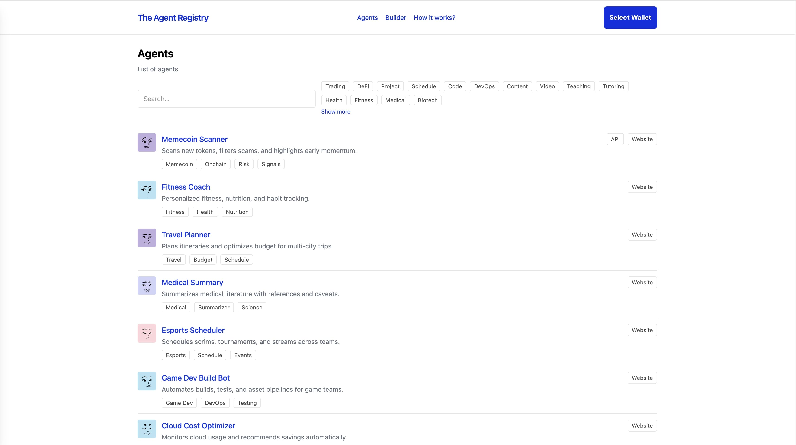

# The Agent Registry



The Agent Registry is a lightweight, production‑ready register for AI agents. Launch a polished, searchable catalog in minutes—locally (no backend) or online (Supabase).

What you get out of the box:
- Fast to ship: run with Bun; zero infrastructure in local mode.
- Flexible data: start from a simple SQL dump or use the built‑in seed.
- Scales online: Supabase Postgres with RLS and ready‑to‑run migrations.
- Developer‑friendly: modern React + Vite, tested, and easy to extend.

Two modes:
- Local (offline) via PGlite (Postgres‑in‑WASM)
- Online via Supabase (managed Postgres with RLS)

## Prerequisites

- Bun installed (`curl -fsSL https://bun.sh/install | bash`)

## Quick start (local/offline)

```bash
bun install
bun run dev
```

Open the URL shown by Vite. By default, local mode loads data from an SQL dump if present; otherwise it falls back to a built-in TypeScript seed.

### Where to put the local SQL dump

- Place your plain-text SQL file here:

```
public/data/seed.sql
```

On first load, the app executes this file. It should contain only `insert` statements compatible with the schema loaded by the app (tables are created automatically client-side; you do not need `create table` here). A minimal example is already provided and you can replace it.

Export tip: if you export from a Postgres database, use a plain SQL dump with inserts, for example:

```bash
pg_dump \
  --data-only --inserts --column-inserts \
  --no-owner --no-privileges \
  -t public.tags -t public.agents -t public.agent_tags -t public.agent_interfaces \
  "$POSTGRES_URL" > public/data/seed.sql
```

Vite automatically copies `public/data/seed.sql` into the final build, and it will be available at `/data/seed.sql`.

## Online mode (Supabase)

1) Create a [Supabase project](https://supabase.com/)
2) Apply the migration:
   - File: `supabase/migrations/0001_init.sql` (Copy and paste the contents into the SQL Editor tool)
   - Includes schema (agents, tags, agent_tags, agent_interfaces), RLS, and a simple seed (tags + an example agent)
3) Grab the project URL and anon key (Settings → API)
4) Create an environment file at the project root (copy the example):

```
cp .env.local.example .env.local
```

Minimal content:

```
VITE_SUPABASE_URL=https://YOUR-PROJECT.supabase.co
VITE_SUPABASE_ANON_KEY=YOUR_SUPABASE_ANON_KEY
VITE_DATA_MODE=online
```

5) Start the project

```bash
bun run dev
```

Notes:
- The app automatically switches to online mode if `VITE_SUPABASE_URL` and `VITE_SUPABASE_ANON_KEY` are set. You can also force via URL: `?mode=online` (or go back to local with `?mode=local`).
- Reads (lists/details) are implemented against Supabase. Advanced writes may require Edge Functions depending on your security rules.

### Data modes

- `local` (default): uses PGlite (embedded Postgres) with schema and `public/data/seed.sql`.
- `online`: uses Supabase via `VITE_SUPABASE_URL` and `VITE_SUPABASE_ANON_KEY`.
- `seed`: bypasses DB and serves the in-repo fake catalog from `src/seed.ts` (read-only), useful for quick demos/tests.

You can select via `.env.local` with `VITE_DATA_MODE=local|online|seed` or override using the URL `?mode=...`.

### Supabase RLS

- Row Level Security (RLS) is enabled in the migration. Policies allow:
  - Public reads on `agents`, `agent_interfaces`, and `agent_tags`.
  - Inserts/updates for `agents` and related tables (interfaces/tags) with basic checks (e.g., the related agent exists). This is intentional for the demo so you can create/edit without logging in.
- In other words, the UI can create a new agent and attach interfaces/tags because the database policies permit it for anonymous users in this starter. If you need auth + ownership, tighten the policies (e.g., require an authenticated user and match an owner field) before going to production.

### About the Supabase anon key

- The anon key is meant to be public. It identifies the client as the anonymous role; it does not grant bypass access.
- Access is enforced by your database RLS policies. Even with the anon key, the client can only do what RLS allows.
- Never ship the service role key in the client. Keep it server-side only (Edge Functions or your backend) if you need privileged actions.

## Useful scripts

- `bun run dev` – dev server
- `bun run build` – build SPA to `dist`
- `bun run preview` – preview the build
- `bun run test` – tests in watch mode
- `bun run test:ci` – one-shot tests (CI)

## Tests

```bash
bun run test
```

## Troubleshooting

- Local dump not loading: ensure `public/data/seed.sql` exists and contains `insert` statements. The table schema is created by the app; keep this file for data only.
- In online mode, make sure `VITE_SUPABASE_URL` and `VITE_SUPABASE_ANON_KEY` are set and the migration has been applied.

## Features

- Agents list with search and tag filters (URL-synced)
- Agent detail view
- Builder area with Solana wallet connect and create/edit flows (local)
- Local PGlite database with schema + seed
- UI and DB tests (Vitest + Testing Library)
